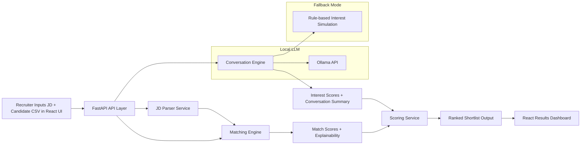

# Architecture Diagram and Scoring Logic

## Architecture Diagram

## Component Responsibilities

- API Layer: receives pipeline request and orchestrates all services.
- JD Parser: extracts seniority and required/optional skills from free-form JD text.
- Matching Engine: computes semantic similarity + skill coverage and returns explainability.
- Conversation Engine: generates simulated candidate outreach turns and an interest score.
- Scoring Service: combines both dimensions into a final rank-ready score.

## Scoring Formulas

Let:
- $S_{semantic}$ = cosine similarity between JD text vector and candidate profile vector.
- $S_{coverage}$ = required skill coverage ratio.
- $S_{match}$ = match score in percent.
- $S_{interest}$ = interest score in percent from engagement simulation.

Match score calculation:

$$
S_{match} = 100 \times (0.65 \cdot S_{semantic} + 0.35 \cdot S_{coverage})
$$

Final ranking score:

$$
S_{final} = w_m \cdot S_{match} + w_i \cdot S_{interest}
$$

Default weights:
- $w_m = 0.6$
- $w_i = 0.4$

These can be changed in the API payload.

## Explainability Strategy

For each candidate, the system returns:
- `matched_skills`: required JD skills found in candidate profile text.
- `missing_skills`: required JD skills not found.
- `keyword_hits`: count of matched required skills.
- `engagement_summary`: short rationale for the generated interest score.

This makes ranking auditable for recruiters and easy to tune.
